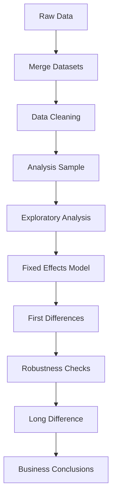

```mermaid
flowchart TD

A[Raw Data] --> B[Merge Datasets]
B --> C[Data Cleaning]
C --> D[Analysis Sample]
D --> E[Exploratory Analysis]
E --> F[Fixed Effects Model]
F --> G[First Differences]
G --> H[Robustness Checks]
H --> I[Long Difference]
I --> J[Business Conclusions]
```
