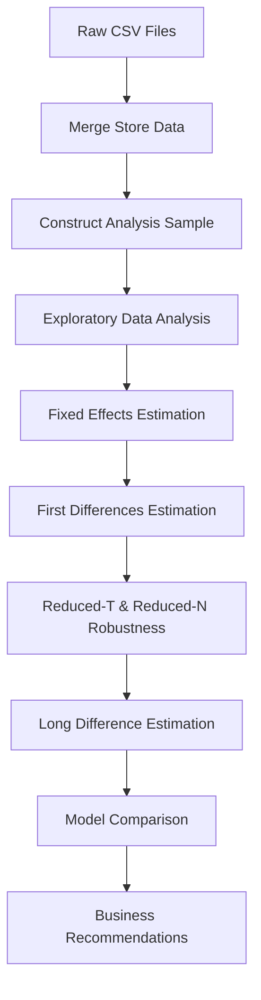

```mermaid
flowchart TD

A[Raw CSV Files] --> B[Merge Store Data]
B --> C[Construct Analysis Sample]
C --> D[Exploratory Data Analysis]
D --> E[Fixed Effects Estimation]
E --> F[First Differences Estimation]
F --> G[Reduced-T & Reduced-N Robustness]
G --> H[Long Difference Estimation]
H --> I[Model Comparison]
I --> J[Business Recommendations]
```
